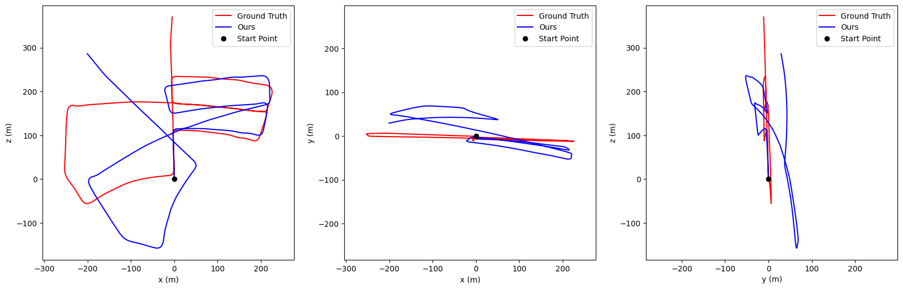

# DeepVO
This repository is an unofficial PyTorch implementation of DeepVO. Here is the [link](https://ieeexplore.ieee.org/stamp/stamp.jsp?arnumber=7989236) to the original ICRA 2017 paper. The codes are mainly based on another unofficial [implementation](https://github.com/ChiWeiHsiao/DeepVO-pytorch) of DeepVO but with some modifications and extentions. 

Key differences:
- The generation of ground truth relative poses is modified. We first compute the 4x4 transformation matrix between adjacent frames and then convert it into rotations and translations. For example, we have two 4x4 transformation matrices M1 and M2 that represent the global poses (relative to the starting point) at time 1 and 2. Then, the relative pose transformation matrix M' between time 1 and 2 can be calculated by M' = inv(M1) * (M2). Then, we can extract R' and t' from M'. t' is the relative translation and the relative rotations can be extracted from R' using function `euler_from_matrix` in `helper.py`.
- The inference is different. Here we directly input the whole video to the LSTM without breaking them into independent segments. The way we accumulate the relative poses is also different. 
- Horizontal flipping is added as an augmentation method

## Dataset
Please download the KITTI Odometry dataset (color, 65GB) following this [link](http://www.cvlibs.net/datasets/kitti/eval_odometry.php) and place it under the `dataset` folder. The data path should look like `dataset/sequence/00`. The ground truth poses are provided under the `dataset/poses` folder. Please modify `params.py` to set up the right path.

## Preprocessing
Run `preprocessing.py` to get the ground truth for relative poses. The 6DoF relative poses are represented as rotations (roll, pitch, yaw) and translations (x, y, z). 

## Pre-trained FlowNet model
We refer people to the original [github](https://github.com/ChiWeiHsiao/DeepVO-pytorch) to download the pre-trained FlowNet. Please modify `params.py` to set up the right path.

## Train the DeepVO model
Run `train.py` to train the DeepVO model. The model will be saved at `experiments/experiment_name/models` and the log file will be stored under `experiments/experiment_name/record`. The hyper-parameters are included in `params.py` and instructions are provided inside. The default image size is set to be `192 x 640`

## Test the DeepVO model
Run `test.py` to generate estimations under `experiments/experiment_name/results`. 

To evaluate the test results, run `evaluation.py` to generate visualizations under `experiments/experiment_name/results`. The evaluation code is borrowed from [link](https://github.com/LeoQLi/KITTI_odometry_evaluation_tool). 

## Results 

03

04

05

06

07

10

